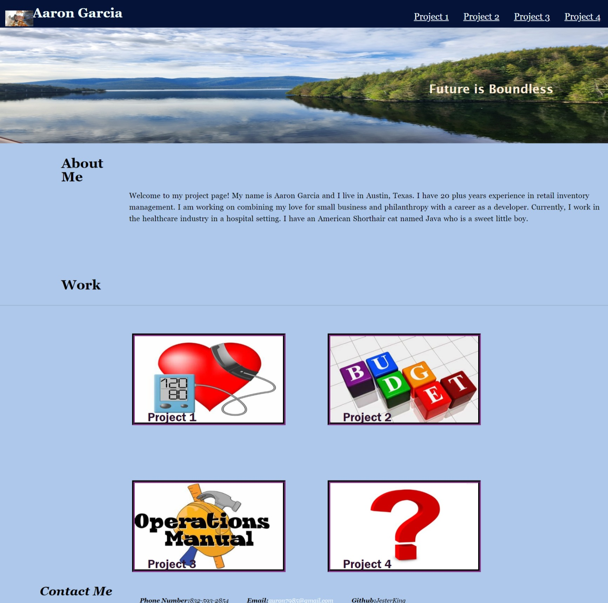

# AG-Portfolio

## Description

Landing Page for personal portfolio displaying projects. I used HTML to build the bones and CSS to give it some skin; used as a learning exeprience for both. Hopefully, will get a better handle on CSS so that I can update the style of the page in the future.

## Table of Contents

N/A

## Installation Instructions

N/A

## Usage
Page allows me to show any projects I am working on or completed. Anyone can check out things I have done.

## Credit

N/A

## License

Please refer to the license in the repo

